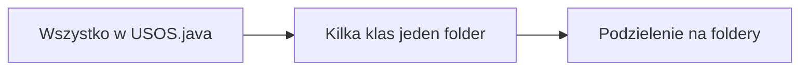

## Usos w javie

_Szybike readme tegotypu_

---

#### Polecenie +/-

Zadanie polegalo na stworzeniu imitacji usosa w javie

- zrobic klasy polaczone w specyficzny sposob oraz dodanie
- zrobic jakis interface
- dla poszczegolnych klas napisac specyficzne metody np. dodawanie oceny

---

#### Moj kod

Przez caly moj kod mozna znalesc dokumentacje, gdzie rozpisuje sie o danej klasie.

> Z jednego duzego pliku zostal podzielony na klasy -> foldery z klasami dla czytelnosci

nalezy wlaczyc plik z `Java-usos/` inaczej dane sie nie zapisza, `main` znajduje sie w `USOS.java`

_sry za balagan w klasach_

---

#### TO DO

_Do dodania jest jeszcze kilka funkcji, zrobie je w wolnym czasie albo kiedy przyomni mi sie ten projekt_
_Dodakowo program jest wgl nieoptymalnie napisany xdd w przypadku normalnego usosa np nauczyciel jest przypisany do z 30 kursow kazdy majacy przypisane np po 500 osob nie sa to liczby nie mozliwe ale trzeba znalesc lepsze rozwiazanie_

- metody usuwania ocen/uczniow/studentow/kursow
- moze dodanie dziennika by zapisywac occeny
- znalesc bardziej optymalne rozwiazanie dla wpisywanie ocen np zapisanie czuniow w klasie nauczyciela
- ~~dodanie cos ala baza danych w FileHandler~~
- dodac interowanie nowo dodanych osob, a nie indeksy wpisywac
